# 1.Install archLinux with EFI systemd-boot and GPT without GUI

## 1. Start arch-Linux by live-CD

After successfully start arch-Linux by live-CD, you can see :

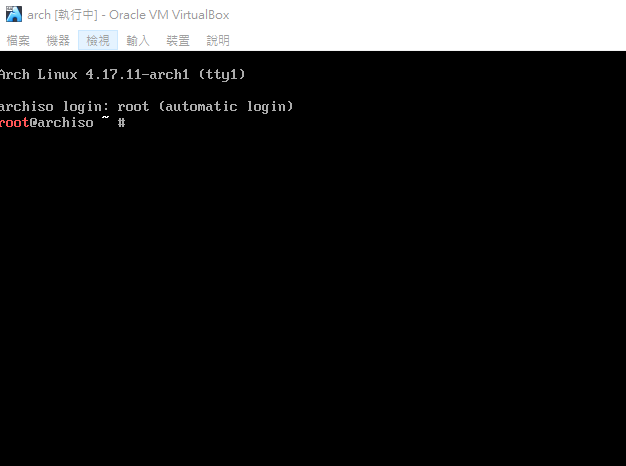

You can also check net-work by :

`ping google.com -c 2`

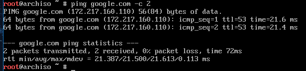

## 2. Partition by cgdisk \(GPT\)

```bash
parted -l #List all verbose of your disk.
```

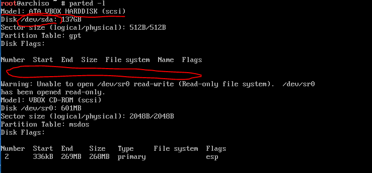

Pay attention to the place where the red circle!

Model is your disk model. ArchLinux system can give it alias.

If your disk is sata device then  it can show /dev/sda or /dev/sdb or /dev/sdc ...

If your disk is device then it can show /dev/0 or /dev/nvme1 or /dev/nvme2 ...

Select your disk in this list which you want to install.  

We assume that /dev/sda

```bash
cgdisk /dev/sda #launch cgdisk with /dev/sda.
```

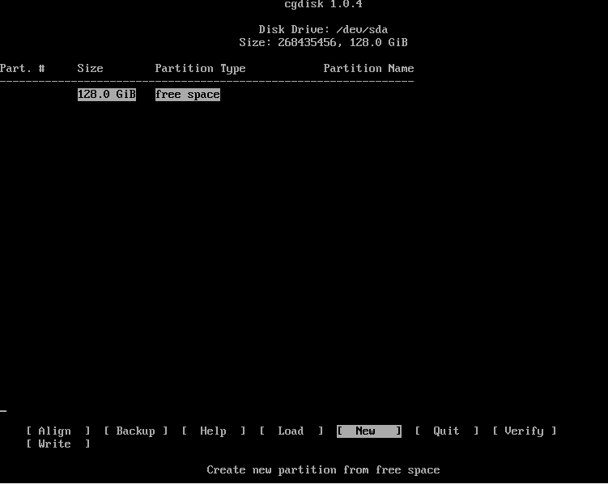

There are many partitioning tools for Linux,

such as fdisk, gdisk, cfdisk, cgdsik, parted ... etc.

I prefer to cgdsik.

Use cgdisk to guarantee partition is GPT and it similar to **cfdisk** easy to use!

You need to create 3 partition at least in the cgdisk :

1. **EFI partition**: for efi boot. I suggest setting size of this partition as **1GB**.
2. **swap partition**: for swap. I suggest setting size of this partition as **your memory\(RAM\) size**.
3. **Linux partition**: for your linux system.I suggest setting size of this partition as **remaining space**.

If you don't know how to use cgdisk,

refer to \(8:00~16:00\):
[cgdisk_video](https://youtu.be/W1PygRlo97U?t=8m)

After partition, you can see it in the cgdisk:

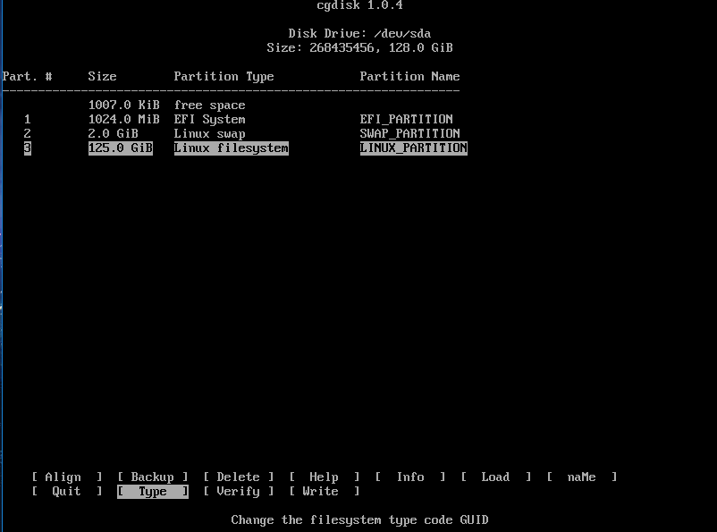

Don't forget to type `w` to write your partition setting to disk.

Type `q` to leave cgdisk.

You can also check partition by :

```text
parted -l
```

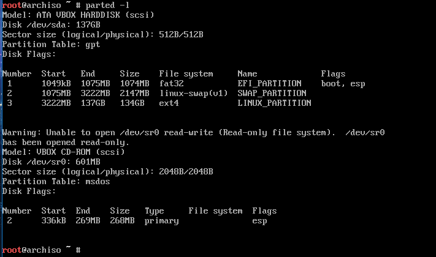

after you leave cgdisk.

You can also compare with previous picture "first use parted -l"

## 3. Make file system\(formatted\)

1. formatted ESP\(EFI system partition\) as vfat\(fat32\) and label it as EFI. Note that the label need be upper case.

   ```bash
   mkfs.vfat /dev/sda1 -n "EFI"
   ```

2. formatted swap and label it as "SWAP" and start swap

   ```bash
   mkswap /dev/sda2 -L "SWAP" && swapon /dev/sda2
   ```

3. formatted Linux main partition and label it as "ARCH\_MAIN"

   ```bash
   mkfs.ext4 /dev/sda3 -L "ARCH_MAIN"
   ```

4. check it

   ```bash
   lsblk -o name,label,size,uuid
   ```

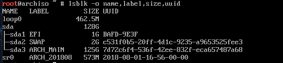

## 4. Mount device after formatted

1. check /mnt is empty

   ```bash
   Pacman -Sy tree #install a good tool for list file and directory by tree list
   tree /mnt
   #if result is 0 directories, 0 files , then result is correct.
   ```

2. Mount ArchMin partition to /mnt

   `mount /dev/sda3 /mnt`

3. create boot directory in /mnt

   `mkdir /mnt/boot`

4. mount boot partition to /mnt/boot

   `mount /dev/sda1 /mnt/boot`

5. check it :

   `tree /mnt && lsblk -o name,label,size,uuid,mountpoint`

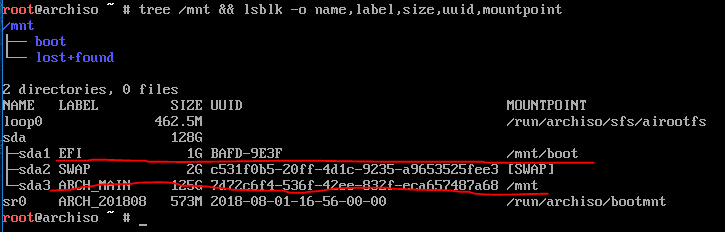

## 4-A. If you want install ArchLinux with LVM & dm-crypt

```text
gdisk /dev/sda
```

```text
GPT fdisk (gdisk) version 1.0.1

Partition table scan:
  MBR: protective
  BSD: not present
  APM: not present
  GPT: present

Found valid GPT with protective MBR; using GPT.

Command (? for help): o
This option deletes all partitions and creates a new protective MBR.
Proceed? (Y/N): Y

Command (? for help): n
Partition number (1-128, default 1):
First sector (34-242187466, default = 2048) or {+-}size{KMGTP}:
Last sector (2048-242187466, default = 242187466) or {+-}size{KMGTP}: +512M
Current type is 'Linux filesystem'
Hex code or GUID (L to show codes, Enter = 8300): EF00
Changed type of partition to 'EFI System'

Command (? for help): n
Partition number (2-128, default 2):
First sector (34-242187466, default = 1050624) or {+-}size{KMGTP}:
Last sector (1050624-242187466, default = 242187466) or {+-}size{KMGTP}:
Current type is 'Linux filesystem'
Hex code or GUID (L to show codes, Enter = 8300):
Changed type of partition to 'Linux filesystem'

Command (? for help): p
Disk /dev/sda: 242187500 sectors, 115.5 GiB
Logical sector size: 512 bytes
Disk identifier (GUID): 9FB9AC2C-8F29-41AE-8D61-21EA9E0B4C2A
Partition table holds up to 128 entries
First usable sector is 34, last usable sector is 242187466
Partitions will be aligned on 2048-sector boundaries
Total free space is 2014 sectors (1007.0 KiB)

Number  Start (sector)    End (sector)  Size       Code  Name
   1            2048         1050623   512.0 MiB   EF00  EFI System
   2         1050624       242187466   115.0 GiB   8300  Linux filesystem

Command (? for help): w
```

```bash
mkfs.vfat -F32 /dev/sda1

cryptsetup --cipher aes-xts-plain64 --key-size 512 --hash sha512 --iter-time 5000 luksFormat /root/luks.vol -v
#--cipher aes-xts-plain64 :ase
# --iter-time 10000 : avoid Violent cracking

cryptsetup luksOpen /dev/sda2 luks
# cryptsetup luksClose lukds # umount luks form /dev/mapper

# cryptsetup luksAddKey /dev/sda2 PathToEnryptFile #add another key with key file
# cryptsetup luksAddKey /dev/sda2 #add another key
# cryptsetup luksKillSlot /dev/sda2 SoltID(1~9) # Kill one key, use luksDump to find SoltID

cryptsetup luksDump /dev/sda2 #check luks


pvcreate /dev/mapper/luks
vgcreate vg0 /dev/mapper/luks
lvcreate -L 4G vg0 -n swap
lvcreate -l +100%FREE vg0 -n root

mkfs.ext4 /dev/mapper/vg0-root
mkswap /dev/mapper/vg0-swap

mount /dev/mapper/vg0-root /mnt
swapon /dev/mapper/vg0-swap

mkdir /mnt/boot
mount /dev/sda1 /mnt/boot
```

## 4-B. If you want install ArchLinux with RAID

### 4-B-0. Remove old RAID (If u want)

    1. In the openSUSE 12.3 installer, switch to the console.
    
    2. List your devices: `# df -kh`
    
    3. Make sure the devices are unmounted: `# umount /dev/md124`
    
    4. Check the details: `# mdadm --detail /dev/md124`
    
    5. Stop the device: `# mdadm -S /dev/md124`
    
    6. Zero out the superblocks of physical devices that belong to the MD device:
      `# mdadm --zero-superblock /dev/sdb1` -> one of RAID device`
      `# mdadm --zero-superblock /dev/sda1` -> one of RAID device`
       or
      `# mdadm --zero-superblock /dev/nvme0n1p1` -> one of RAID device`
      `# mdadm --zero-superblock /dev/nvme1n1p1` -> one of RAID device` 
      
    7. Switch back to the installer.
    
    8. In the partitioning part of installer, refresh devices.
    
    9. The MD devices should not be there now.

### 4-B-1. Create(Check) partition:

```
-/dev/sda1 -> boot (ef00)
-/dev/sdb1 -> raid-1_0 (fd00)
-/dev/sdc1 -> raid-1_1 (fd00)
```

or

```
-/dev/sda1 -> boot (ef00)
-/dev/nvme0n1p1 -> raid-1_0 (fd00)
-/dev/nvme1n1p1 -> raid-1_1 (fd00)
```

### 4-B-2. Create RAID-1:

Create RAID-1 with 2 disk:
```
mdadm --create --name=RAID1_DEV --verbose --level=1 --raid-devices=2 /dev/md0 /dev/sdb1 /dev/sdc1
```
or

```
mdadm --create --name=RAID1_DEV --verbose --level=1 --raid-devices=2 /dev/md0 /dev/nvme1n1p1 /dev/nvme1n1p1
```


**warning!!!!!*

**above command of sequence can't be changed**

Waitting for raid created,

should be some minute (nvmessd)

check progress

```
mdadm -D /dev/md0
```

### 4-B-3. Update configuration file

```
# mdadm --detail --scan >> /etc/mdadm.conf
```

### 4-B-4. Assemble the array

```
# mdadm --assemble --scan
```

### 4-B-5. Create filesystem

```
mkfs.xfs /dev/md0 -L "RAID_SYS"
```

### 4-B-6. Mount device

``` bash
mount /dev/md0 /mnt
mkdir /mnt/boot 
mount /dev/sda1 /mnt/boot
```

### 4-B-7 Install ArchLinux

```
pacstrap /mnt base base-devel linux linux-firmware xfsprogs mdadm
```

### 4-B-8 Copy `mdadm.conf`

```
mdadm --detail --scan >> /mnt/etc/mdadm.conf
```

#### 4-B-9 genfstab

```
genfstab /mnt -p -U >> /mnt/etc/fsbab
```

#### 4-B-10 Chroot

```
arch-chroot /mnt
```


## 4-B-10. Configuer mkinitcpio with raid

Needed package:
``` bash
pacman -S xfsprogs #if ur fs is xfs
pacman -S mdadm
```

open `vim /etc/mkinitcpio.conf`
modify here:
```
HOOKS="base udev autodetect modconf block mdadm_udev filesystems fsck"
BINARIES=(mdmon)
```

`mkinitcpio -p linux`

## 5. Configure  mirror list for install arch-Linux and pacman

1st, please go here
https://www.archlinux.org/mirrorlist/all/
to update your mirror list
```
wget https://www.archlinux.org/mirrorlist/all/ -O /etc/pacman.d/mirrorlist
```

open /etc/pacman.d/mirrorlist

```bash
 vim /etc/pacman.d/mirrorlist
```

you can see :

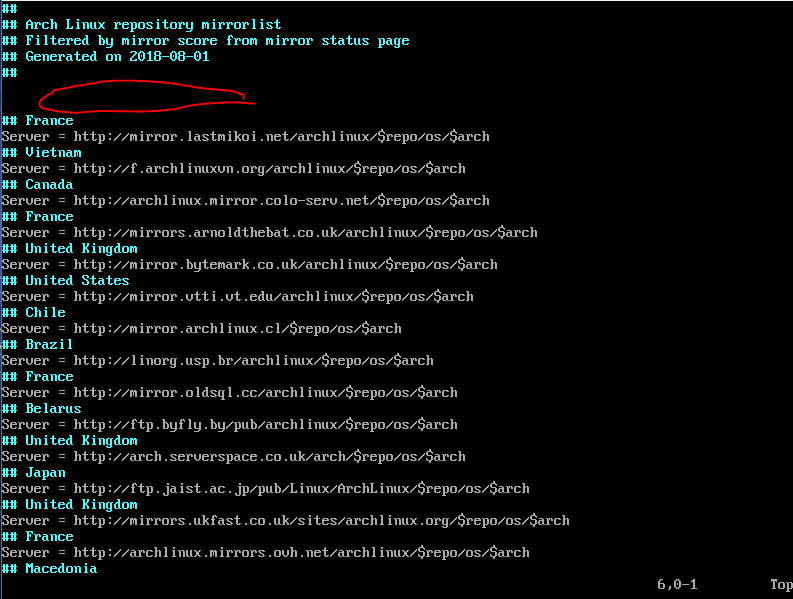

You must paste the nearest mirror server site in a red circle.

For instance, I live in Taiwan. So put there server site on top :

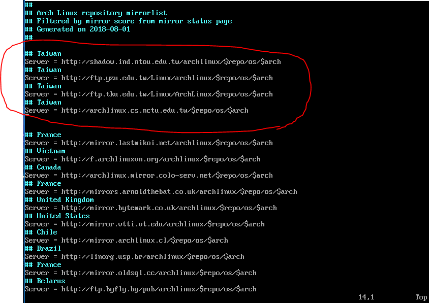

Press `: wq` to leave mirror list.

There are useful command for vim \(one the command mode\) :

`:/\x` => find x and don't distinguish uppercase or lowercase.

`n`  => if finded x, then go next.

`v +  ← or →` => igh light selected.

`y` => copy where selected.

`p` => paste.

`:wq` => save and leave vim.

`:w!` => leave vim without save.

## 6. Install Arch Linux

```bash
pacstrap /mnt base base-devel linux linux-firmware
```

base-devel include basic software development tools.

Such as gcc g++ ... etc.

## 7. Generate file system table

When Linux boots, it can automatically mount devices in fstab.

```bash
genfstab -U -p /mnt > /mnt/etc/fstab
#generate file system table and wirte it to /mnt/etc/fstab
```

After generation, you can also check it :

```bash
cat /mnt/etc/fstab
```

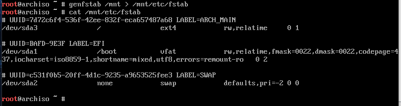

## 7.A If you create RAID with mdadm, do:

``` bash
mdadm --detail --scan --verbose   >>   /mnt/etc/mdadm.conf
```


## 8. chroot to /mnt

If there are no problems so far.

arch-chroot /mnt

You can see:

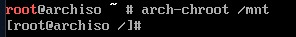

Let's do some system configure next!

## 9. Install first tools

```
pacman -S base bash-completion tree vim python 
pacman -S xfsprogs # if ur fs is xfs
```

## 10. Configure time

```bash
 ln -sf /usr/share/zoneinfo/Asia/Taipei /etc/localtime #if I live in Taipei Asia
 hwclock --systohc --utc
```

or

```bash
timedatectl set-timezone Asia/Taipei
timedatectl set-ntp true
```

check:

```
timedatectl
```

find `timezone` and `NTP`

## 11. Configure yay and enabel 32bits package for pacman

```bash
cd ~/Downloads
git clone https://aur.archlinux.org/yay.git
cd yay
makepkg -si
# -si: install dependency and install package after successfully build
cd ..
rm -rf yay
```

Open `pacman.conf`:
```
vim /etc/pacman.conf
```

go to line 93 and line 94, uncomment :

```text
[multilib]
Include = /etc/pacman.d/mirrorlist
```

It  permit your system can install 32-bit package.

## 12. Add user and configure sudo

1. Configure user

   ```bash
   passwd #set root password
   useradd -mg users -G wheel,storage,power -s /bin/bash <your_new_user>
   #your_new_user is your username, you can replace it as needed
   passwd your_new_user # set <your_new_user>'s password
   ```

2. Configure sudo

   ```bash
   pacman -S sudo
   visudo
   #go to line 82, uncomment:
   %wheel ALL=(ALL) ALL
   ```

   Result looking like below :

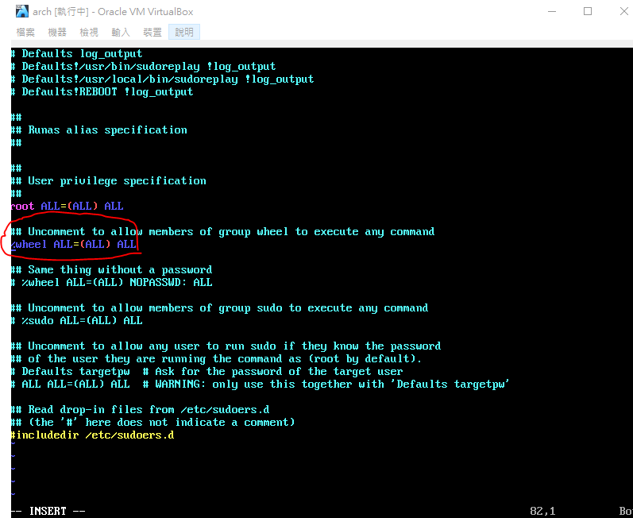

If fine, type`:wq` to save and leave.

## 13. Configure boot loader \(systemd-boot\)

There are many program for boot-loader, such as grub, systemd, rEFInd ... etc.

I prefer to systemd-boot.

Let's configure systemd-boot :

1. Install efibootmgr :

   ```text
   pacman -S efibootmgr
   ```

2. if your computer is intel-cpu, install intel-ucode, else if your computer is AMD cpu, install amd-ucode

   ```bash
   pacman -S intel-ucode #if your computer is intel-cpu
   pacman -S amd-ucode #if your computer is AMD-cpu
   ```

If installation is fine,

let's go to configure /boot :

`bootctl --path=/boot install`

if `bootctl`  fail, you can also manually configure it by below step :

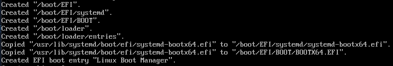

Let's go to configure /boot/loader/loader.conf :

`vim /boot/loader/loader.conf`

Modify this content as:

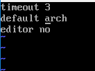

Press `:wq` to save and leave

Next configure  /boot/loader/entries/arch.conf :

Before configure it, We need to do something first:

```text
blkid /dev/sda3 >> /boot/loader/entries/arch.conf
```

`/dev/sda3` is your arch installed disk/partition

and next do :

```text
ls /boot >> /boot/loader/entries/arch.conf
```

Content of `ls /boot` can show something information for configure arch.conf .

Now we open /boot/loader/entries/arch.conf by vim:

`vim /boot/loader/entries/arch.conf`

It looking like :

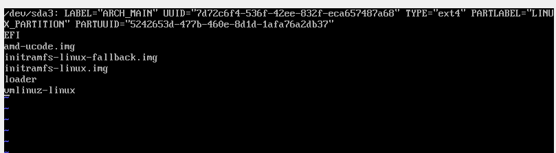

There is result of execute previous command :

`ls /boot >> /boot/loader/entries/arch.conf`

and

`blkid /dev/sda3 >> /boot/loader/entries/arch.conf`

We type something in the first :

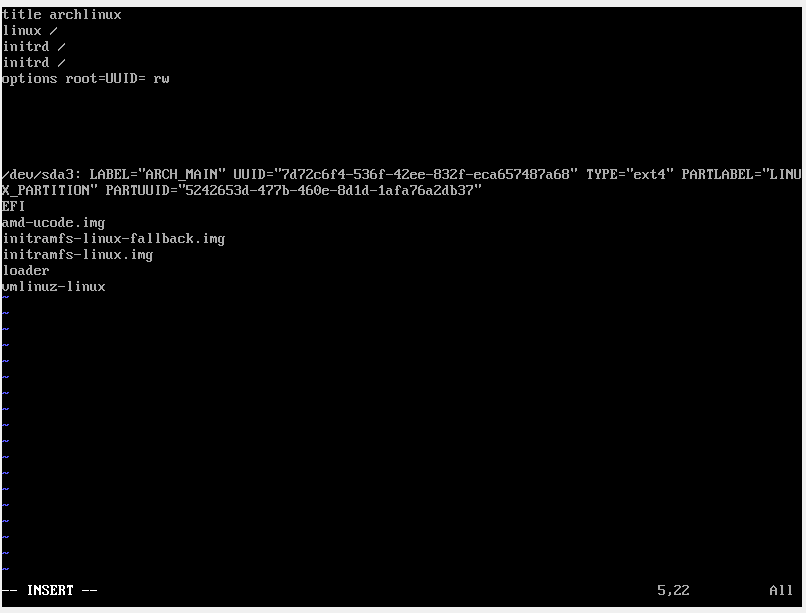

Now, we fill some information to initrd and linux and optins

by command append of "`ls /boot >> /boot/loader/entries/arch.conf`"

and "`blkid /dev/sda3 >> /boot/loader/entries/arch.conf`" :

result likes below :

```text
title ArchLinux
linux /vmlinuz-linux
initrd /intel-ucode.img
initrd /initramfs-linux.img
options root=UUID=813f4e26-e161-4820-a714-c22a69762483 rw

/dev/sda3: LABEL="LINUX_FS" UUID="813f4e26-e161-4820-a714-c22a69762483" TYPE="xfs" PARTLABEL="LINUX_PART" PARTUUID="807ac753-8b7c-49d3-82d2-2ac49ff9d39b"
EFI
loader
initramfs-linux-fallback.img  
matteo-catanese-401213-unsplash.jpg
initramfs-linux.img
vmlinuz-linux
intel-ucode.img
```

Delete unwanted information:

```text
title ArchLinux
linux /vmlinuz-linux
initrd /intel-ucode.img
initrd /initramfs-linux.img
options root=UUID=813f4e26-e161-4820-a714-c22a69762483 rw
```

Type `:wq` leave.

```text
#In addtion to:
#intel-ucode.img or amd-ucode.img
#must put beforen itramfs-linux.img
```

note:

if your computer is intel cpu, then amd-ucode.img becomes to intel-ucode.img.

Last, generate kernel:
```bash
mkinitcpio -p linux
```

## 13-A. Configuer boot with LVM & dm-crypt

### 13-A-1. generate initcpio

Edit `/etc/mkinitcpio.conf`

```text
MODULES="ext4"
.
.
.
HOOKS="base udev autodetect modconf block keymap encrypt lvm2 resume filesystems keyboard fsck"
```

```text
mkinitcpio -p linux
```

### 13-A-2. Configure systemd-boot

```bash
pacman -S intel-ucode #if your computer is intel-cpu
pacman -S amd-ucode #if your computer is AMD-cpu

pacman -S efibootmgr
bootctl --path=/boot install
```

Configure directories of boot

```text
bootctl --path=/boot install
```

Edit /boot/loader/loader.conf

```text
timeout 0
default arch
editor 0
```

Create `/boot/loader/entries/arch.conf`

```text
blkid /dev/sda2 >> /boot/loader/entries/arch.conf
ls /boot >> /boot/loader/entries/arch.conf
lsblk /dev/sda2 >> /boot/loader/entries/arch.conf
```

edit `/boot/loader/entries/arch.conf` as:

&lt;YOUR-PARTITION-UUID&gt; is UUID of /dev/sda2 in this case

```text
title Arch Linux
linux  /vmlinuz-linux
initrd /initramfs-linux.img
initrd /amd-ucode
options cryptdevice=UUID=<YOUR-PARTITION-UUID>:lvm:allow-discards resume=/dev/mapper/vg0-swap root=/dev/mapper/vg0-root rw quiet
```

## 14. reboot and login your user

After complete step 13.

Type `exit` can go back to live-CD.

Reboot system by this command :

`reboot`

You can login by your user name

and type your user passwd.

\(same as step 12.\)

For me, my user name is dzwei ,

so type dzwei and enter.

After first successful login,

You must modify your password.

Because in the step 12. , `chage -d 0 your_new_user`

Ok, now switch user to root, We have something don't complete!

`su root`

## 15. Configure locale

`vim /etc/locale.gen`

First, go to line 176.

Uncomment `en_US.UFT-8 UFT-8`

like below :

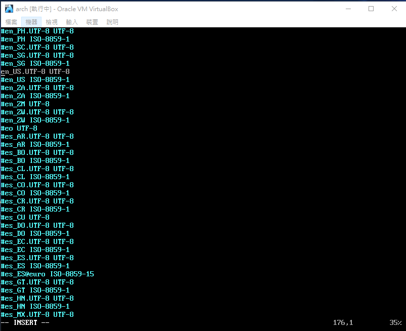

If you want to install other locales, unmcomment locales which you want in this file.

For me, I want Taiwan :

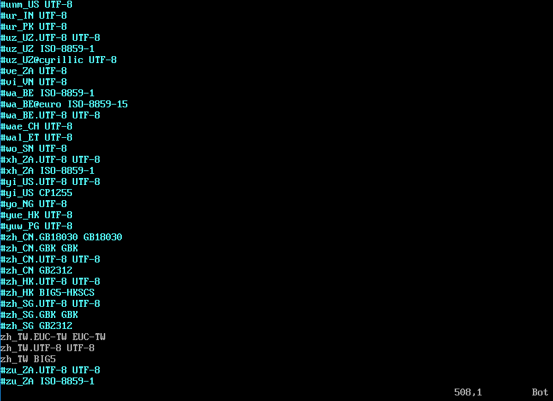

Type `:wq` to save and leave.

run`locale-gen`

We need to use `localectl` to set system language as en\_US.UTF-8.

Otherwise launch gnome-terminal have problem.

`localectl set-locale LANG=en_US.UTF-8`

\(if localectl fail, you can localectl again after reboot\)

After above setting, we need to restart computer :

`reboot`

After login, type locale to check your system language is `en_US.UTF-8`

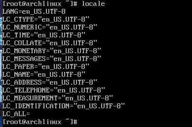

## 16. Modify hostname

### 16-1. permanent hostname

```bash
echo "your_host_name" > /etc/hostname
reboot
```

or

```bash
hostnamectl set-hostname "your_host_name"
reboot
```

### 16-2. temporary hostname \(change to the original system hostname after reboot\)

```bash
hostname "your_host_name"
```

## 17.Start network\(DHCP\)

`systemctl start dhcpcd`

`systemctl enable dhcpcd`

`ping google.com -c 2`

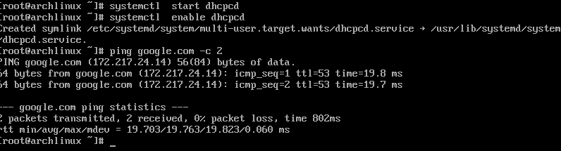

## 18. Install desktop environment

if you want to install
**Cinnamon-desktop environment**
see:

_**`2. Install Cinnamon-desktop with LightDM`**_
