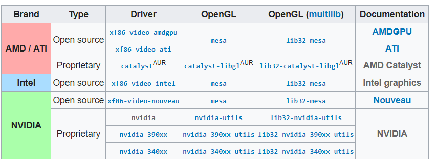
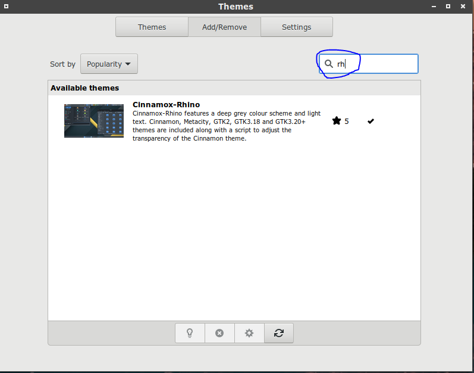
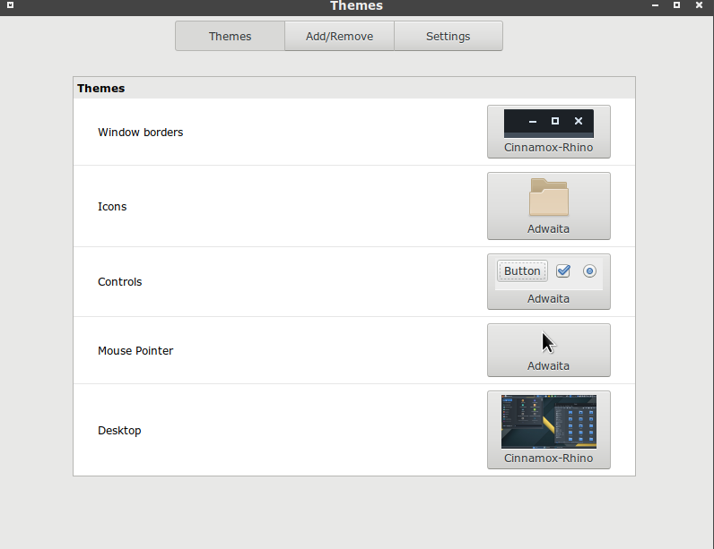
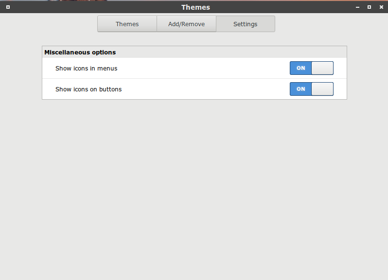
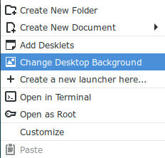
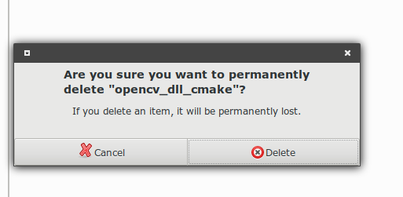

# 2.Install Cinnamon-desktop and LightDM

## 0. You must login by root when you install below program

**You can also select gnome-desktop.**

**See** _**2. Install gnome-desktop and good tools**_

## 1. Install VGA driver

Check vga driver which it is your VGA

```text
lspci | grep -e VGA -e 3D
```

Select your driver below table :



And install it :

if nvidia VGA :

`pacman -S xf86-video-noubeau mesa`

if AMD VGA :

`pacman -S xf86-video-amdgpu mesa`

if Virtual Box

`pacman -S mesa`

if Intel VGA :

`pacman -S xf86-video-intel mesa`

## 2. Install xorg

```bash
pacman -S xorg xorg-server mesa
```

## 3. Install Cinnamon desktop environment and lightdm

Install Cinnamon

```bash
pacman -S cinnamon nemo-fileroller
```

Install LightDM\(Light-desktop manager\)

```bash
pacman –S lightdm lightdm-gtk-greeter lightdm-gtk-greeter-settings

# to configure it,
# open "lightdm-gtk-greeter-settings" in your desktop
# please put your all image for login on /boot/Pictures
# otherwise the image cannot be loaded when login
```

Install gnome-terminal for first terminal in GUI

```bash
pacman –S gnome-terminal xterm #(xterm for backup termaina)
```

Start Cinnamon desktop

```bash
systemctl enable lightdm.service
systemctl start lightdm.service
```

## 4. Issue about preview icon \(icon prewiew .pgn .jpg .pdf file\)

About nemo preview, you must setting up it :

[nemo_preview](https://askubuntu.com/questions/395911/why-doesnt-nemo-preview-thumbnails)

## 5. Install 1st web browser

```bash
pacman –S firefox
```

## 6. Install font

install 繁體中文與字體

```bash
sudo pacman -S wqy-zenhei ttf-arphic-ukai
```

or refer to:

[Chinese_TC](https://wiki.archlinux.org/index.php/Localization/Traditional_Chinese_%28正體中文%29)

## 7. Configure theme

### 7-1 Download theme Cinnamox-Rhino

Go to Setting/Themes.

Select tab of Add/Remove.

Search `Rhino` and download it.



### 7-2 Configure theme

Go to Setting/Themes.

Select tab of Themes.

Configure it as



### 7-3 Configure buttons for rendering themes

Go to Setting/Themes.

Select tab of Setting.

Turn on all:



result likes:





## 8. If install gnome

## 8. Installing command


``` bash
sudo pacman -S gnome gnome-tweaks filemanager-actions
# filemanager-actions can add openvscode_here in right click
```


### 8-1. Install top icon for flameshot
``` bash
yay gnome-shell-extension-topicons-plus
removeable-drive-menu
```


### 8-2. after install

Remove:

``` bash
pacman -Rsn 
gnome-boxes 
gnome-books 
gnome-screenshot 
epiphany
gnome-software
gnome-music
gnome-contacts
gnome-photos
gnome-weather
gnome-maps
gnome-shell
sushi
eog
```
### 8-3. chenge session
Gnome default wayland as session,
but there lots of bugs,
so we replace wayland-session with xorg-session:

#### 8-3-1. check session now using
using
``` bash
loginctl
```

find which tty you used.

and check its session:

``` bash
loginctl show-session <tty-used-number> -p Type
```
Now open the GDM configuration file `/etc/gdm/custom.conf` using your favorite text editor.

``` bash
vi /etc/gdm/custom.conf 
```

Then uncomment the line below to force the login screen to use Xorg display manager.

WaylandEnable=false

And add the following line to the [daemon] section as well.

DefaultSession=gnome-xorg.desktop

The whole GDM configuration file should now look like this.

#### 8-3-2. change default session to xorg
```bash
[daemon]
WaylandEnable=false
DefaultSession=gnome-xorg.desktop

[security]
[xdmcp]
[chooser]

[debug]
#Enable=true
```

Save the changes in the file and reboot your system to start using xorg as the default GNOME session manager.

After the system reboot, verify again your session number and type by running the following commands, it should show Xorg.

```
# loginctl	# get session number from command output 
# loginctl show-session <tty-used-number> -p Type
```
### 8-4  Recommanded extension on gnome-extension

```
New Mail Indicator 
TopIcons Plus 
```

## 9. Install other good tools

`Cinnamix-Rhino`

**See :**

`3. Install good tools for ArchLinux`
