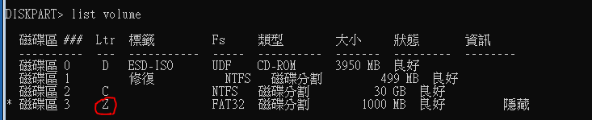
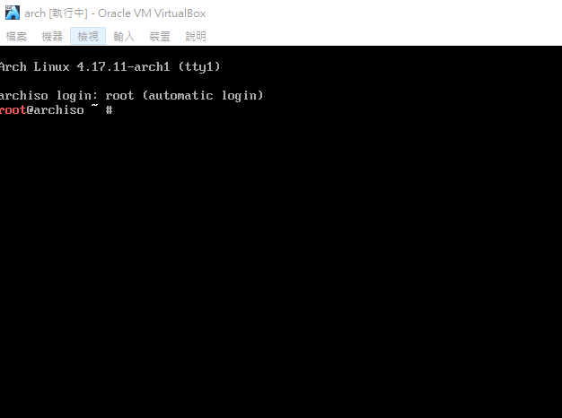

# A1.Install archLinux + win 10 \(dual disk, dual OS\) with EFI systemd-boot and GPT without GUI

## 0. Foreword

Before Start. You must go to your BIOS to close :

1. Fast boot
2. Security boot

Assume you have install windwos 10 with EFI in disk 1.

We install arch Linux in disk 2.

I suggest using 2 disk for install windows and Linux.

## 1.Extend EFI size to 1GB from windows

ESP\(EFI system partition\) only ~100MB in Windows.

If you want install multi OS.

This may not be enough. So we need to extend it!

### 1-1. Compress some space for extend ESP from the Windows system you have installed

Go to windows disk manager.

Right click windows start can find :


On the \(C:\), right click, left click compress disk area


Type 1000 in the size block, press compress:


If OK you can see new unallocated area :


Reboot your computer using windows install CD.

### 1-2. Boot with windows install CD

After successfully boot, you can see :


press next


press repair your computer


press Troubleshooting


press Command prompt


If you successful, you can see :


### 1-3. Extend windows EFI

Entry diskpart:

```bash
diskpart
```


List disk :

```text
listdisk
```


Compressed area of step 1-1. can show here\(red circle\)

select your disk which it has install window 10 with ESP.

For me, I install it in the disk 1:

```text
sel disk 0
```


list its partition :

```text
list partition
```


If you have never use this system.

Disk 2 \(type is system\) is ESP for windows.

\(size of ESP of Windows default 99MB\)

We select it :

```text
sel partition 2
```


We delete this partition :

```text
delete partition override
```


Now we create new partition for ESP :

```bash
create partition efi # can add flag size=1000
```


And format it as FAT32

```text
format fs=fat32
```


After format, check it and its size and its type

```text
list partition
```


Now we need to label this partition :

First

```text
list volume
```


disk area 3 is ESP on my system.

You can check by some information :

1. Fs = FAT32
2. Size = 1000 MB
3. information = hide

We select this volume :

```text
sel volume 3
```


and label disk area 3 \(ESP\) as Z

```text
assign Letter Z
```


We check it after assign letter

```text
list volume
```



If fine, leave diskpart

```text
exit
```


Now we need to create windows boot files in the new ESP :

```text
bcdboot C:\windows /s Z: /f UEFI


# /s Z:   => assign ESP is Z:\
# /f UEFI => create ESP base on EFI instead of BIOS
```


Now, you just reboot.

If you can entry window. That is success.

Next, we will install arch Linux for dual boot.

You can change boot media from windows install CD to Live-CD of arch Linux.

## 2. Open arch Linux from Live-CD and select disk for install arch Linux

After you successfully start arch Linux by live-CD :



List disk and select disk for install arch Linux.

Note : disk cannot same as disk which it has install windows.

```text
parted -l
```


Look at above picture.

`/dev/sda` is installed by windows.

`/dev/sda4` is EFI partition by windows.

We also can mount `/dev/sda4` for EFI boot partition of arch Linux.

The `/dev/sdb` is empty, so we select it as Linux disk.

## 3. Partition

As previous said,

We select the /dev/sdb as Linux disk.

Because the ESP has exist \(as previous said, /dev/sda4\),

We don't create the ESP.

Now we entry cgdisk :

```bash
cgdisk /dev/sdb
```

### 3-1. Create SWAP partition

type `n`

First sector -&gt; type `enter` \(default value\)

Size in sector or {KMGTP} -&gt; type `2G` -&gt; type `enter`

Hex code or GUID -&gt; type `8200` -&gt; type `enter`

Enter new partition name or &lt;Enter&gt; to use the current name -&gt; \(optional\) type `enter` -&gt; type `enter`

### 3-2. Create Linux disk partition

type `n`

First sector -&gt; type `enter` \(default value\)

Size in sector or {KMGTP} -&gt; type `enter` \(default value\)

Hex code or GUID -&gt; type `enter`

Enter new partition name or &lt;Enter&gt; to use the current name -&gt; \(optional\) type `enter` -&gt; type `enter`

Type `w` to write.

Type `q` to leave cgdisk.

### 3-3. Check result

Check by

```bash
parted -l
```


## 4. Formatted and Mount

### 4-1. Formatted

Format SWAP\_PARTITION as swap, set it's SWAP

```bash
mkswap /dev/sdb1 -L SWAP && swapon /dev/sdb1
```

Format LINUX\_PARTITION as ext4, set it's name as ARCH

```bash
mkfs.ext4 /dev/sdb2 -L ARCH
```

Check formatted by

```bash
lsblk
```

Result like :


If you want to check its file system :

`blkid`


### 4-2. Mount

```bash
mount /dev/sdb2 /mnt
```

Create boot directory for arch Linux

```bash
mkdir /mnt/boot
```

Mount boot directory for arch Linux

```bash
mount /dev/sda4 /mnt/boot #why I select /dev/sda4, see step.2
```

Check mount by :

```bash
lsblk
```

Result like :


### 4-A. If you want to install ArchLinux with LVM & dm-crypt

```text
gdisk /dev/sda
```

```text
GPT fdisk (gdisk) version 1.0.1

Partition table scan:
  MBR: protective
  BSD: not present
  APM: not present
  GPT: present

Found valid GPT with protective MBR; using GPT.

Command (? for help): o
This option deletes all partitions and creates a new protective MBR.
Proceed? (Y/N): Y

Command (? for help): n
Partition number (1-128, default 1):
First sector (34-242187466, default = 2048) or {+-}size{KMGTP}:
Last sector (2048-242187466, default = 242187466) or {+-}size{KMGTP}: +512M
Current type is 'Linux filesystem'
Hex code or GUID (L to show codes, Enter = 8300): EF00
Changed type of partition to 'EFI System'

Command (? for help): n
Partition number (2-128, default 2):
First sector (34-242187466, default = 1050624) or {+-}size{KMGTP}:
Last sector (1050624-242187466, default = 242187466) or {+-}size{KMGTP}:
Current type is 'Linux filesystem'
Hex code or GUID (L to show codes, Enter = 8300):
Changed type of partition to 'Linux filesystem'

Command (? for help): p
Disk /dev/sda: 242187500 sectors, 115.5 GiB
Logical sector size: 512 bytes
Disk identifier (GUID): 9FB9AC2C-8F29-41AE-8D61-21EA9E0B4C2A
Partition table holds up to 128 entries
First usable sector is 34, last usable sector is 242187466
Partitions will be aligned on 2048-sector boundaries
Total free space is 2014 sectors (1007.0 KiB)

Number  Start (sector)    End (sector)  Size       Code  Name
   1            2048         1050623   512.0 MiB   EF00  EFI System
   2         1050624       242187466   115.0 GiB   8300  Linux filesystem

Command (? for help): w
```

```bash
mkfs.vfat -F32 /dev/sda1

cryptsetup --cipher aes-xts-plain64 --key-size 512 --hash sha512 --iter-time 5000 luksFormat /root/luks.vol -v
#--cipher aes-xts-plain64 :ase
# --iter-time 10000 : avoid Violent cracking

cryptsetup luksOpen /dev/sda2 luks
# cryptsetup luksClose lukds # umount luks form /dev/mapper

# cryptsetup luksAddKey /dev/sda2 PathToEnryptFile #add another key with key file
# cryptsetup luksAddKey /dev/sda2 #add another key
# cryptsetup luksKillSlot /dev/sda2 SoltID(1~9) # Kill one key, use luksDump to find SoltID

cryptsetup luksDump /dev/sda2 #check luks


pvcreate /dev/mapper/luks
vgcreate vg0 /dev/mapper/luks
lvcreate -L 4G vg0 -n swap
lvcreate -l +100%FREE vg0 -n root

mkfs.ext4 /dev/mapper/vg0-root
mkswap /dev/mapper/vg0-swap

mount /dev/mapper/vg0-root /mnt
swapon /dev/mapper/vg0-swap

mkdir /mnt/boot
mount /dev/sda1 /mnt/boot
```

## 5. Configure mirror list of pacman

```bash
vim /etc/pacman.d/mirrorlist

#put nearest site for you on this file top
#press :wq to leave with save
#you can refer to Step 5 of 1. Install archLinux with EFI systemd-boot and GPT
```

## 6. Install arch Linux

```bash
pacstrap /mnt base base-devel linux-linux-firmware
```

## 7. Generate file system table and chroot

### 7-1. Generate fstab and check

```text
genfstab -U -p /mnt > /mnt/etc/fstab
```

Check it :

```text
cat /mnt/etc/fstab
```

Result like :


### 7-2. chroot

chroot to /mnt

```bash
arch-chroot /mnt
```

## 8. Install basic tools

```bash
pacman -S base python bash-completion vim tree
```

## 9. Configure time

```text
 ln -sf /usr/share/zoneinfo/Asia/Taipei /etc/localtime #if I live in Taipei Asia  
 hwclock --systohc --utc
```

or

```bash
timedatectl set-timezone Asia/Taipei
timedatectl set-ntp true
```

## 11. Configure yay and enabel 32bits package for pacman

```bash
cd ~/Downloads
git clone https://aur.archlinux.org/yay.git
cd yay
makepkg -si
# -si: install dependency and install package after successfully build
cd ..
rm -rf yay
```

go to line 93 and line 94, uncomment :

```text
[multilib]
Include = /etc/pacman.d/mirrorlist
```

It  permit your system can install 32-bit package.

## 11. Add user and configure sudo

### 11-1. Configure user

```bash
passwd #set root password
useradd -mg users -G wheel,storage,power -s /bin/bash your_new_user
#your_new_user is your username, you can replace it as needed
passwd your_new_user
```

### 11-2. Configure sudo

```bash
pacman -S sudo
visudo
#go to line 82, uncomment:
%wheel ALL=(ALL) ALL
```

 If fine, type`:wq` to leave.

## 12. Configure boot loader \(systemd-boot\)

### 12-1. Install needed package for boot

1. Install efibootmgr :

   ```text
   pacman -S efibootmgr
   ```

2. if your computer is intel-cpu, install intel-ucode, else if your computer is AMD cpu, install amd-ucode

   ```bash
   pacman -S intel-ucode #if your computer is intel-cpu
   pacman -S amd-ucode   #if your computer is AMD-cpu
   ```

### 12-2. Configure ESP

Configure ESP **automatically** :

`bootctl --path=/boot install`

if `bootctl` **fail**,

you can also **manually** configure it by below step :


### 12-3. Configure loader file

Create loader.conf

```text
vim /boot/loader/loader.conf

​#content
default arch
timeout 3
editor no
```

 If fine, type`:wq` to leave.

Create arch.conf \(my CPU is AMD-CPU\)

```bash
blkid >> /boot/loader/entries/arch.conf
ls /boot >> /boot/loader/entries/arch.conf​
```

```bash
vim /boot/loader/entries/arch.conf
```

edit  `/boot/loader/entries/arch.conf`

that its content like:

```bash
title arch Linux
linux /vmlinuz-linux.img
initrd /amd-ucode.img
initrd /initrdramfs-linux.img
options root=UUID=db656ba8-279c-4b43-978c-327ea52b4e0c rw
```

UUID is UUID of LVM ARCH\_LV

```text
#In addtion to:
#intel-ucode.img or amd-ucode.img
#must put beforen itramfs-linux.img
```

refer to

Step.13  of 1. Install archLinux with EFI systemd-boot and GPT

 If fine, type`:wq` to leave.

## 12-A. Configuer boot with LVM & dm-crypt

### 12-A-1. generate initcpio

Edit `/etc/mkinitcpio.conf`

```text
MODULES="ext4"
.
.
.
HOOKS="base udev autodetect modconf block keymap encrypt lvm2 resume filesystems keyboard fsck"
```

```text
mkinitcpio -p linux
```

### 12-A-2. Configure systemd-boot

```bash
pacman -S intel-ucode #if your computer is intel-cpu
pacman -S amd-ucode #if your computer is AMD-cpu

pacman -S efibootmgr
```

Configure directories of boot

```text
bootctl --path=/boot install
```

Edit /boot/loader/loader.conf

```text
timeout 0
default arch
editor 0
```

Create `/boot/loader/entries/arch.conf`

```text
blkid /dev/sda2 >> /boot/loader/entries/arch.conf
ls /boot >> /boot/loader/entries/arch.conf
lsblk /dev/sda2 >> /boot/loader/entries/arch.conf
```

edit `/boot/loader/entries/arch.conf` as:

&lt;YOUR-PARTITION-UUID&gt; is UUID of /dev/sda2 in this case

```text
title Arch Linux
linux  /vmlinuz-linux
initrd /initramfs-linux.img
initrd /amd-ucode
options cryptdevice=UUID=<YOUR-PARTITION-UUID>:lvm:allow-discards resume=/dev/mapper/v
```

## 13. reboot and login your user

After complete step 14.

Type `exit` can go back to live-CD.

Reboot system by this command :

`reboot`

You first can see :


Press `↓` or `↑` high light OS , type `enter` to entry OS which you be selected.

You can login by your user name

and type your user passwd.

\(same as step 13.\)

For me, my user name is dzwei ,

so type dzwei and enter.

After first successful login,

You must modify your password.

Because in the step 13. , `chage -d 0 your_new_user`

OK, now switch user to root, We have something don't complete!

`su root`

## 14. Configure locale

`vim /etc/locale.conf`

First, go to line 176.

Uncomment `en_US.UFT-8 UFT-8`

​

If you want to install other locales,

unmcomment locales which you want in this file.

​

Type `:wq` to save and leave.

run :

`locale-gen`

We need to use `localectl` to set system language as en\_US.UTF-8.

Otherwise launch gnome-terminal have problem.

run :

`localectl set-locale LANG=en_US.UTF-8`

After above setting, we need to restart computer :

`reboot`

After login, type

`locale`

to check your system language is `en_US.UTF-8`

## 15. Modify hostname

### 15-1. permanent hostname

```bash
echo "your_host_name" > /etc/hostname
reboot
```

or

```bash
hostnamectl set-hostname "your_host_name"
reboot
```

### 15-2. temporary hostname \(change to the original system hostname after reboot\)

```bash
hostname "your_host_name"
```

## 16. Start network\(DHCP\)

`systemctl start dhcpcd`

`systemctl enable dhcpcd`

`ping google.com -c 2`

## 17. Install desktop environment

if you want to install

_**Cinnamon-desktop environment**_

see:

_**`2. Install Cinnamon-desktop with LightDM`**_
