# A2.Install archLinux + LVM with EFI systemd-boot and GPT without GUI

## 0. Foreword

This chapter focus on LVM,

\(**step2**. **step4**. **step5**. **step10**.\)

other steps will be more compact than

[1.Install archLinux with EFI systemd-boot and GPT without GUI](https://dz-arch.gitbook.io/project/install-archlinux-with-efi-and-gpt-without-gui)

But lots of Step still similar to

[1.Install archLinux with EFI systemd-boot and GPT without GUI](https://dz-arch.gitbook.io/project/install-archlinux-with-efi-and-gpt-without-gui)

So you can refer it, if this chapter does not clear explanation.

## 1. Select disk which you want to install arch Linux here

List disk, select disk which you want to install arch Linux here

```bash
parted -l
```

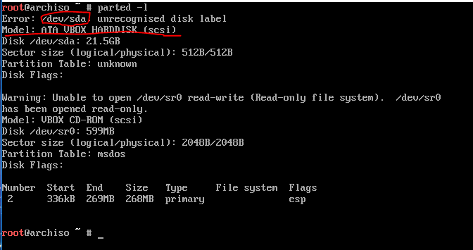

We assume /dev/sda

## 2. Check if you have previously installed LVM, so scan PV, VG, LV first

Check if LVM exists :

```bash
pvscan
vgscan
lvscan
```

If LVM does not exist. Like :  

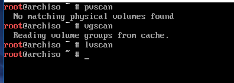

Go to step 3.

Otherwise please remove all PV, VG, LV first \(please step by step to do\) :

```bash
lvdisplay #show result of existing lv,
          #assume LV name are LV1 LV2 which path is /dev/VGX/LV1 /dev/vgx/LV2
lvremove /dev/VGX/LV1 /dev/vgx/LV2 #remove LV1 and LV2

vgdisplay #show result of existing vg, assume VG Name are VG1 VG2
vgremove VG1 VG2 #remove VG1 and VG2

pvdisplay #show result of existing pv, assume /dev/sda1 /dev/sda3
pvremove /dev/sda1 /dev/sda3 #remove all pvs

#suggest rebooting after all remove has finished
```

## 3. Partition

_**`Note :`**_

_**`ESP(EFI system partition) can't be located on partition of LVM,`**_

_**`otherwise systemd-boot can't detect it boot partition.`**_

_**`Unless you have other ESP, such as windows EFI.`**_

_**`If yes, you don't make partition for EFI/boot.`**_

_**`Just mount it to Linux boot directory(Step 5.)`**_.

### 3-1. Create ESP

See picture of step1. Assume you choose /dev/sda as Linux disk

```text
cgdisk /dev/sda
```

type `n`

First sector -&gt; type `enter` \(default value\)

Size in sector or {KMGTP} -&gt; type `1G` -&gt; type `enter`

Hex code or GUID -&gt; type `ef00` -&gt; type `enter`

Enter new partition name or &lt;Enter&gt; to use the current name -&gt; \(optional\) type `enter` -&gt; type `enter`

### 3-2. Create LVM partition for Linux system and swap

type `n`

First sector -&gt; type `enter` \(default value\)

Size in sector or {KMGTP} -&gt; type `enter` \(default value\)

Hex code or GUID -&gt; type `8e00` -&gt; type `enter`

Enter new partition name or &lt;Enter&gt; to use the current name -&gt; \(optional\) type `enter` -&gt; type `enter`

Type `w` to write.

Type `q` to leave cgdisk.

### 3-3. Check result

Check by

```bash
parted -l
```

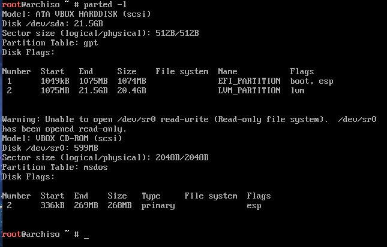

## 4. Create LVM

### 4-1. Create PV

Create PV from /dev/sda1

```bash
pvcreate /dev/sda2
```

Check PV after you create it

```bash
pvdisplay
```

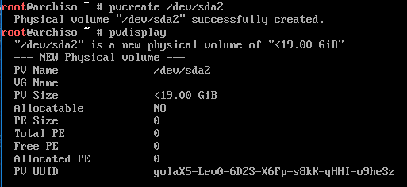

### 4-2. Create VG

Create VG. Set its name as vg1

```bash
vgcreate vg1 /dev/sda2 #if don't create vg and sure vg1 is not exist, please reboot
```

Check VG after you create it

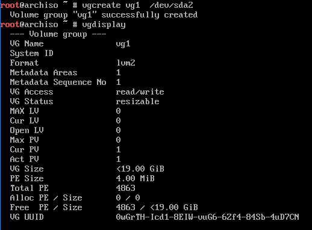

### 4-3. Create LV

Create LV for swap

```bash
lvcreate -L 2G -n SWAP_LV vg1
```

Create LV for main disk of arch Linux

```bash
lvcreate -l 100%FREE -n ARCH_LV vg1
```

Check LV after you create it

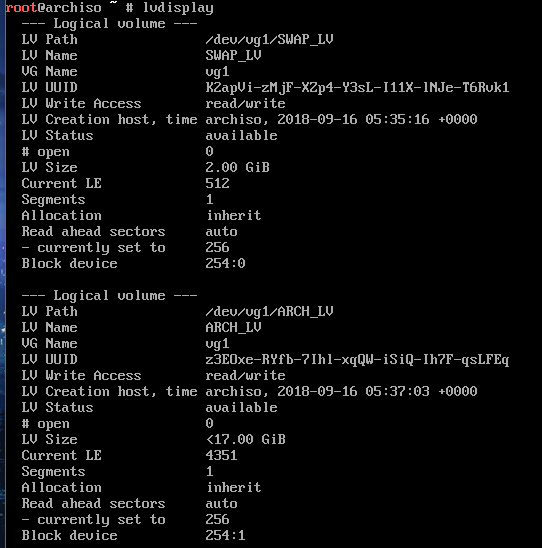

## 5. Formatted and Mount

### 5-1. Formatted

Format EFI\_LV as vfat\(fat32\), set it's name as EFI

```bash
mkfs.vfat /dev/sda1 -n EFI
```

Format SWAP\_LV as swap, set it's SWAP

```bash
mkswap /dev/vg1/SWAP_LV -L SWAP && swapon /dev/vg1/SWAP_LV
```

Format ARCH\_LV as ext4, set it's name as ARCH

```bash
mkfs.ext4 /dev/vg1/ARCH_LV -L ARCH
```

Check formatted by

```bash
lsblk
```

Result like :

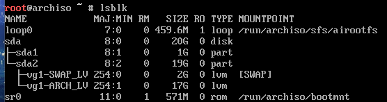

If you want to check its file system :

`blkid`

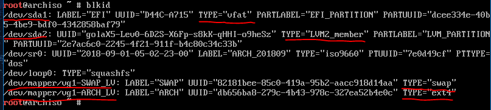

### 5-2. Mount

```bash
mount /dev/mapper/vg1-ARCH_LV /mnt
```

Create boot directory for LVM for arch Linux

```bash
mkdir /mnt/boot
```

Mount boot directory to LVM for arch Linux

```bash
mount /dev/sda1 /mnt/boot
```

Check mount by :

```bash
lsblk
```

Result like :

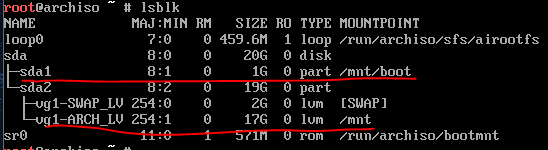

## 6.Configure server site of mirror for pacman

```bash
vim /etc/pacman.d/mirrorlist

#put nearest site for you on this file top
#press :wq to leave with save
#you can refer to Step 5 of 1. Install archLinux with EFI systemd-boot and GPT
```

## 7. Install arch Linux

```text
pacstrap /mnt base base-devel linux-linux-firmware
```

## 8. Generate fstab and chroot to your installed arch Linux

### 8-1. Generate fstab and check

```text
genfstab -U -p /mnt > /mnt/etc/fstab
```

Check it :

```text
cat /mnt/etc/fstab
```

Result like :

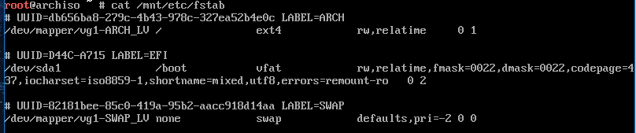

### 8-2. Chroot

chroot to /mnt

```bash
arch-chroot /mnt
```

## 9.Install basic tools

```bash
pacman -S base python bash-completion vim tree
```

## 10.Configure initramfs for LVM

Open /etc/mkinitcpio

```text
vim /etc/mkinitcpio.conf
```

Go to line 52

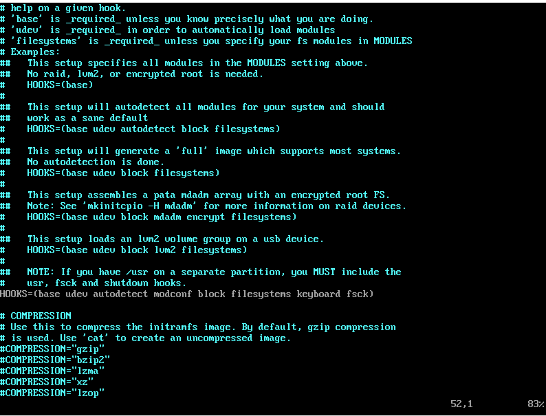

Add lvm2 here

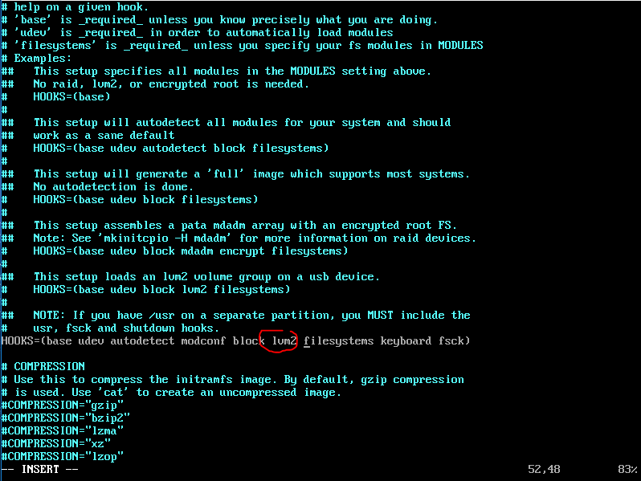

_**Note :**_

_**`lvm2` must put between `block` and `filesystem`**_

Type `:wq` leave with save file.

Regenerate initranfs :

 `mkinitcpio -p linux`

## 11. Configure time

```text
 ln -sf /usr/share/zoneinfo/Asia/Taipei /etc/localtime #if I live in Taipei Asia
 hwclock --systohc --utc
```

or

```bash
timedatectl set-timezone Asia/Taipei
timedatectl set-ntp true
```

## 11. Configure yay and enabel 32bits package for pacman

```bash
cd ~/Downloads
git clone https://aur.archlinux.org/yay.git
cd yay
makepkg -si
# -si: install dependency and install package after successfully build
cd ..
rm -rf yay
```

go to line 93 and line 94, uncomment :

```text
[multilib]
Include = /etc/pacman.d/mirrorlist
```

It  permit your system can install 32-bit package.

## 13.  Add user and configure sudo

### 13-1. Configure user

```bash
passwd #set root password
useradd -mg users -G wheel,storage,power -s /bin/bash your_new_user
#your_new_user is your username, you can replace it as needed
passwd your_new_user
```

### 13-2. Configure sudo

```bash
pacman -S sudo
visudo
#go to line 82, uncomment:
%wheel ALL=(ALL) ALL
```

 If fine, type`:wq` to leave.

## 14. Configure boot loader \(systemd-boot\)

### 14-1. Install needed package for boot

1. Install efibootmgr :

   ```text
   pacman -S efibootmgr
   ```

2. if your computer is intel-cpu, install intel-ucode, else if your computer is AMD cpu, install amd-ucode

   ```text
   pacman -S intel-ucode #if your computer is intel-cpu
   pacman -S amd-ucode   #if your computer is AMD-cpu
   ```

### 14-2. Configure ESP

Configure ESP **automatically** :

`bootctl --path=/boot install`

if `bootctl` **fail**

you can also **manually** configure it by below step :


### 14-3. Configure loader file

Create loader.conf

```bash
vim /boot/loader/loader.conf

#content
default arch
timeout 3
editor no
```

 If fine, type`:wq` to leave.

Create arch.conf \(my CPU is AMD-CPU\)

Now, we fill some information to initrd and linux and optins

by command append of "`ls /boot >> /boot/loader/entries/arch.conf`"

and "`blkid /dev/sda3 >> /boot/loader/entries/arch.conf`" :

result likes below :

```text
title ArchLinux
linux /vmlinuz-linux
initrd /intel-ucode.img
initrd /initramfs-linux.img
options root=UUID=813f4e26-e161-4820-a714-c22a69762483 rw

/dev/sda3: LABEL="LINUX_FS" UUID="813f4e26-e161-4820-a714-c22a69762483" TYPE="xfs" PARTLABEL="LINUX_PART" PARTUUID="807ac753-8b7c-49d3-82d2-2ac49ff9d39b"
EFI
loader
initramfs-linux-fallback.img  
matteo-catanese-401213-unsplash.jpg
initramfs-linux.img
vmlinuz-linux
intel-ucode.img
```

Delete unwanted information:

```text
title ArchLinux
linux /vmlinuz-linux
initrd /intel-ucode.img
initrd /initramfs-linux.img
options root=UUID=813f4e26-e161-4820-a714-c22a69762483 rw
```

Type `:wq` leave.

```text
#In addtion to:
#intel-ucode.img or amd-ucode.img
#must put beforen itramfs-linux.img
```

note:

if your computer is intel cpu, then amd-ucode.img becomes to intel-ucode.img.

If fine, type`:wq` to leave.

## 15.  reboot and login your user

After complete step 14.

Type `exit` can go back to live-CD.

Reboot system by this command :

`reboot`

You can login by your user name

and type your user passwd.

\(same as step 13.\)

For me, my user name is dzwei ,

so type dzwei and enter.

After first successful login,

You must modify your password.

Because in the step 13. , `chage -d 0 your_new_user`

OK, now switch user to root, We have something don't complete!

`su root`

## 16.  Configure locale

`vim /etc/locale.conf`

First, go to line 176.

Uncomment `en_US.UFT-8 UFT-8`

If you want to install other locales,

unmcomment locales which you want in this file.

Type `:wq` to save and leave.

run :

`locale-gen`

We need to use `localectl` to set system language as en\_US.UTF-8.

Otherwise launch gnome-terminal have problem.

run :

`localectl set-locale LANG=en_US.UTF-8`

After above setting, we need to restart computer :

`reboot`

After login, type

`locale`

to check your system language is `en_US.UTF-8`  

## 17. Modify hostname

### 17-1. permanent hostname

```bash
echo "your_host_name" > /etc/hostname
reboot
```

or

```bash
hostnamectl set-hostname "your_host_name"
reboot
```

### 17-2. temporary hostname \(change to the original system hostname after reboot\)

```bash
hostname "your_host_name"
```

## 18.  Start network\(DHCP\)

`systemctl start dhcpcd`

`systemctl enable dhcpcd`

`ping google.com -c 2`

## 19. Install desktop environment

if you want to install

_**Cinnamon-desktop environment**_

see:

_**`2. Install Cinnamon-desktop with LightDM`**_
