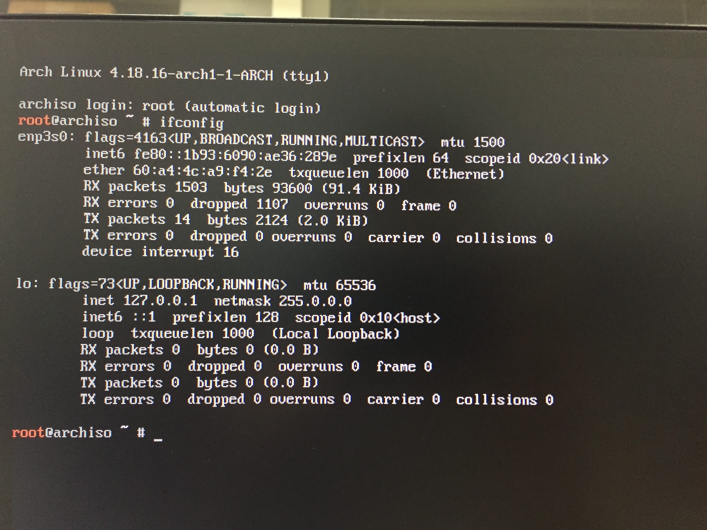

# C00.Configure Static Network

## 1. Disable DHCP

```bash
sudo systemctl stop dhcpcd
sudo systemctl disable dhcpcd
```

## 2. Configure IP and DNS

```bash
sudo ifconfig
```

result like



enp\_s\_ \(for me, is enp3s0\) is your alias of network device

next:

```bash
sudo vim /etc/systemd/network/20-wired.network
```

key in:

```bash
#enp3s0 is your alias of network device
[Match]
Name=enp3s0

[Network]
Address=120.105.133.190/24
Gateway=120.105.133.254
DNS=8.8.8.8 8.8.4.4
```

after save above file.

next:

```bash
vim /etc/systemd/resolved.conf
```

append
```
DNS=8.8.8.8 8.8.4.4
```

## 3. Enable systemd-networkd

```bash
sudo systemctl enable systemd-networkd
sudo systemctl start systemd-networkd
```

## 4. Enable systemd-resolved.service

```bash
sudo systemctl enable systemd-resolved.service
sudo systemctl start systemd-resolved.service
```

## 5. Testing

### 5-1. Check DNS

```bash
nmcli device show|grep DNS
#or
systemd-resolve --status
```

### 5-2. Check IP

```bash
ip addr
```

### 5-3. test networking

```bash
ping 8.8.8.8
#if fine, do
ping google.com
```

if "ping 8.8.8.8" is fine but "ping google.com" not:

do

```bash
echo "nameserver 203.64.173.48\nnameserver 203.64.173.49\nnameserver 203.8.8.8\n" > /etc/resolv.conf
```

again

## 6. Configure DNS for PGP-Key

Refer to [gpg: keyserver receive failed: Server indicated a failure](https://bbs.archlinux.org/viewtopic.php?id=259473&p=2) \#29

And [Arch wiki](https://wiki.archlinux.org/title/Systemd-resolved)

If your software relies on *glibc*, then that software will d DNS En/Decode with `/etc/resolv.conf`

So please do:

`# ln -sf ../run/systemd/resolve/stub-resolv.conf /etc/resolv.conf`

