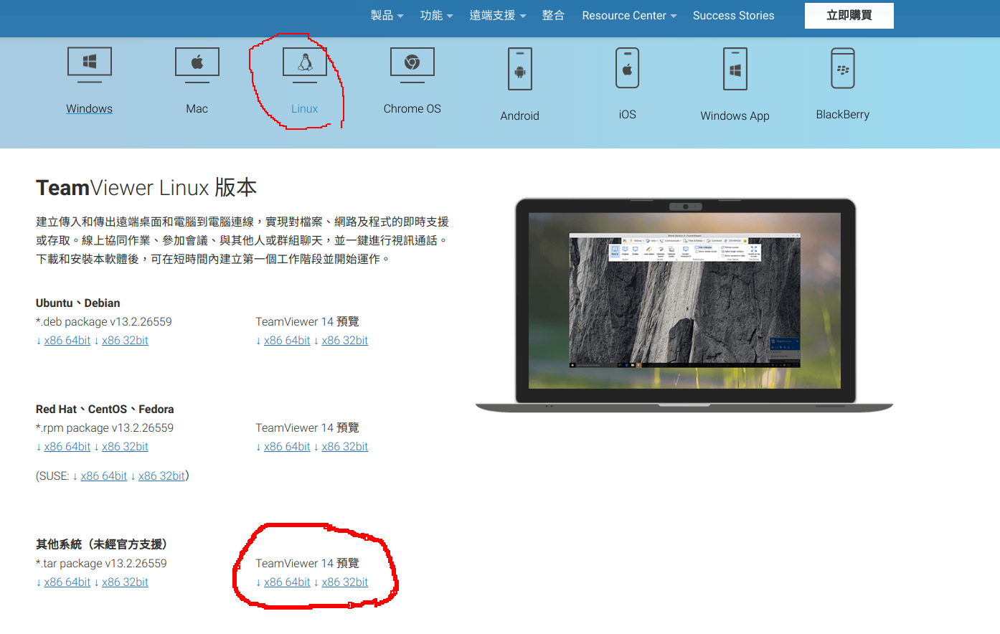
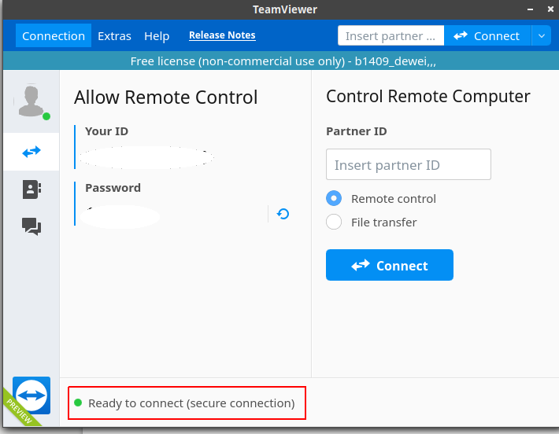
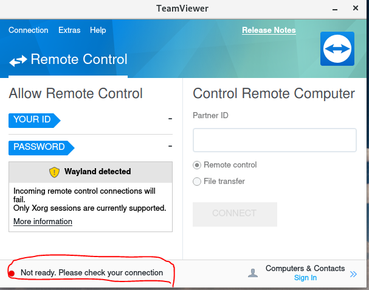
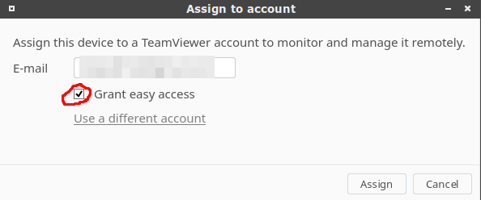
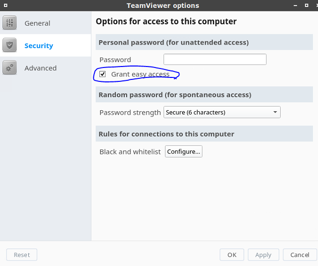

# C02.Configure Teamviewer

## 1. Download and install form official package

### 1-1. Go to official website to download teamviewer



### 1-2. Decompress package and install

After decompress, you will see folder which name is "teamviewer".

Go to this folder. Open terminal. Type

```bash
sudo ./tv-setup install #don't forget install dependency of installer mentioned
```

### 1-3. Launch teamviewerd

```text
sudo systemctl enable teamviewerd.service
sudo systemctl start teamviewerd.service
```

### 1-4.  Check teamviewerd

```text
teamviewer daemon status
```

### 1-5. Open teamviewer if installation successful



## 2. Problem and solution



Sol:

```text
sudo systemctl enable teamviewerd
sudo systemctl start teamviewerd
```

Restart computer.

If open teamviewer still like above picture.

Wait a few seconds

## 3. You must check "Grant easy access" when assign computer to your teamviewer account

Otherwise, you need to key-in random password when login your computer from the far-end.



### 3-1. Or configure it go to "options" -&gt; "security"


