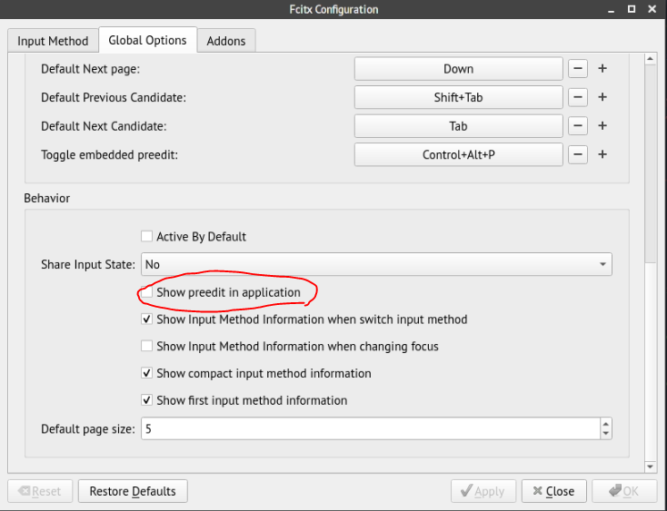

# C03.Configure fcitx-chewing

## 1. Install package

```text
sudo pacman -S fcitx5-im fcitx5-configtool fcitx5-chewing fcitx5-mozc fcitx5-material-color fcitx5-qt fcitx5-gtk
```

## 2. Go to keyboard, set layout as


## 3. Go to fcitx-configuration\(GUI\), Press '+', set as


## 4. set enviroment variable for fcitx

```text
export GTK_IM_MODULE=fcitx5  
export QT_IM_MODULE=fcitx5  
export XMODIFIERS="@im=fcitx5"
```

Copy it to

```text
 /etc/profile
```
## 5. set material-color

open `~/.config/fcitx5/conf/classicui.conf`

append:

```text
# Vertical Candidate List
Vertical Candidate List=True
# Use Per Screen DPI
PerScreenDPI=True
# Use mouse wheel to go to prev or next page
WheelForPaging=True
# Font
Font="思源黑体 CN Medium 13"
# Menu Font
MenuFont="Sans 10"
# Use input method langauge to display text
UseInputMethodLangaugeToDisplayText=True
# Theme
Theme=Material-Color-Brown

```

## 6. Go to Fcitx Configuration, disable "show preedit in application"



If dones't disable it, some editor will have a problme.

## 7. Suggestion of chewing addon


## 8.reboot to test
