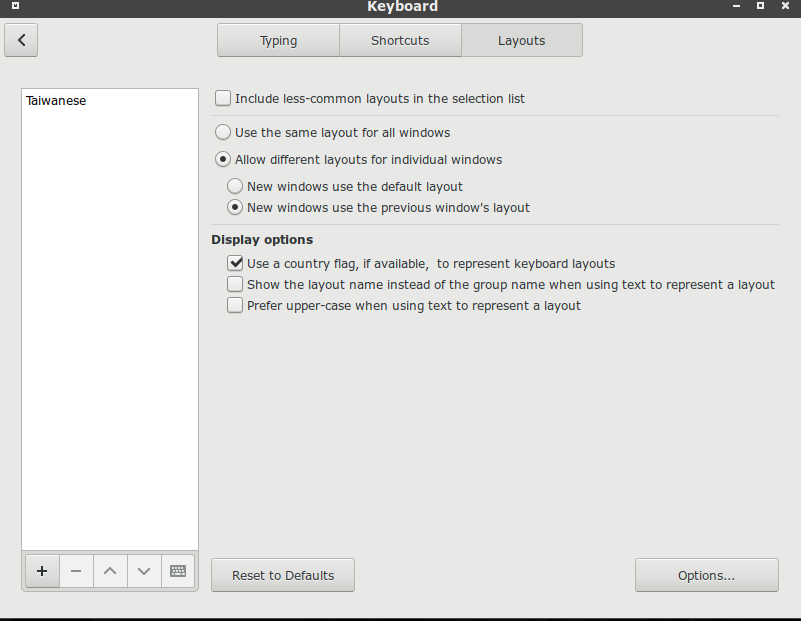
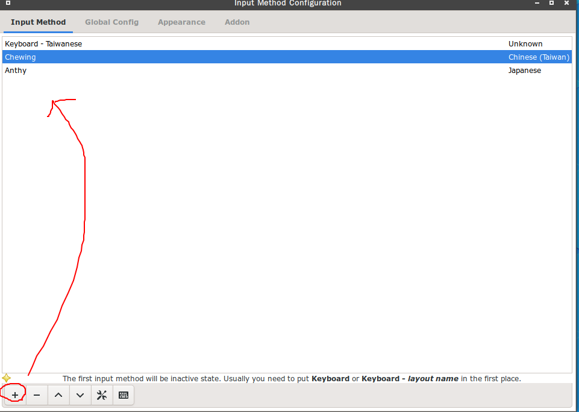

# C03.Configure fcitx-chewing

## 1. Install package

```text
sudo pacman -S fcitx5-im fcitx5-configtool fcitx5-chewing fcitx5-mozc fcitx5-material-color
```

## 2. Go to keyboard, set layout as



## 3. Go to fcitx-configuration\(GUI\), Press '+', set as



## 4. set enviroment variable for fcitx

```text
export GTK_IM_MODULE=fcitx5  
export QT_IM_MODULE=fcitx5  
export XMODIFIERS="@im=fcitx5"
```

Copy it to

```text
 /etc/profile
```
## 5. set material-color

open `~/.config/fcitx5/conf/classicui.conf`

append:

```text
# 垂直候选列表
Vertical Candidate List=

# 按屏幕 DPI 使用
PerScreenDPI=True

# Font (设置成你喜欢的字体)
Font="思源黑体 CN Medium 13"

# 主题
Theme=Material-Color-Brown
```

## 6. Go to Fcitx Configuration, disable "show preedit in application"

If dones't disable it, some editor will have a problme.

## 7.reboot to test
