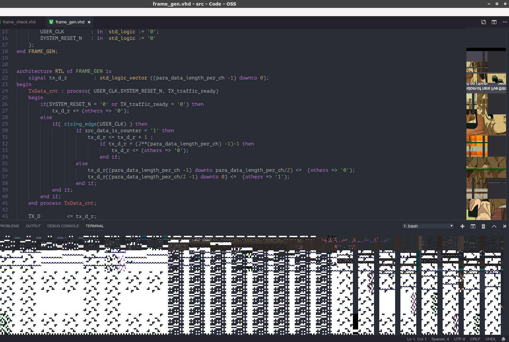

# C04.Configure a vscode

## 1. Needed Package

### 1-1. Install VSCode

```text
sudo pacman -S code
#(install VSCode, package name is "visual studio code oss" on the ubuntu )
```

### 1-2. Install font: PT Mono

```text
yaourt -S ttf-google-fonts-git # for PT Mont
```

### 1-3. Or go here to download ttf file of PT Mono

_**Simply install "PTM55F.ttf" and it will suffice**_

[download_PT_mono_site](https://www.wfonts.com/font/pt-mono)

### 1-4. Others font for suggestion

#### 1-4-1. You can install it via yauort on the archlinux

```text
yaourt -S ttf-ms-fonts # for Courier New, Georgia, Times New Roma
yaourt -S ttf-meslo # for meslo
yaourt -S ttf-monaco # for monaco
```

#### 1-4-2. Or download it on these website

Courier New :
[download_Courier_New](https://fontzone.net/font-download/courier-new)

Menlo
[download_Menlo](https://www.cufonfonts.com/font/menlo)

Monaco
[download_Monaco](https://www.fontpalace.com/font-download/Monaco)

## 2.  Needed Package of VSCode package

```bash
Atom One Dark Theme
beautify
bash beautify
Browser Preview
vscode-icon
C/C++ 
C/C++ Snippets
CMake Tools
Doxygen Documentation Generator
LaTeX Workshop
Python #pylintrc is necessary
autoDocstring #doc for python
VHDL
Modern VHDL
Verilog HDL/SystemVerilog
verilog_Testbench
Markdown All in one
markdownlint
Markdown Preview Github
Markdown Preview Enhance
Markdown PDF
Path Autocomplete
Path Intellsensev
Graphviz Prewiew
Graphviz language support
rust(rls) # rustup is necessary
Rust Doc Viewer
Rainbow End
vscode-pdf
```

## 3. Configure font

### 3-1. Open file -&gt; preference -&gt; search "font" -&gt;go to "Editor: Font Family"

### 3-2. Paste this to "Editor: Font Family"

```text
'PT Mono', Menlo, Monaco, 'Courier New', monospace
```

### 3-3.  Paste above to "Terminal" -&gt; "Font Family" too

## 4. Pitch Black Theme

in the setting, set `window.titleBarStyle` as `custom`

## 5. Minimap and integrated terminal are broken

You may look this bug:



Most of these issues I've been closing but I'll keep this one open for a bit so it's more discoverable.

The problem is related to your graphics drivers and/or Chromium not correctly blacklisting your configuration. Your current options are:

### 5-0. Update your graphics drivers

### 5-1. Disable canvas usage in terminal and minimap with these settings

```text
"terminal.integrated.rendererType": "dom",
"editor.minimap.enabled": false
```

### 5-2. Launch vscode using code --disable-gpu

```text
cd /usr/share/applications
```

```text
sudo vim code-oss.desktop
```

replace

```text
Exec=code-oss --unity-launch %F
```

with

```text
Exec=code-oss  --disable-gpu --unity-launch %F
```

### 5-3. Wait until bug fixed

## 6. Add default standard into `settings.json`

Otherwise `filesysten` of c++17 cannot be lint in some env(e.g. Linux)

```
"C_Cpp.default.cppStandard": "c++17"
```
