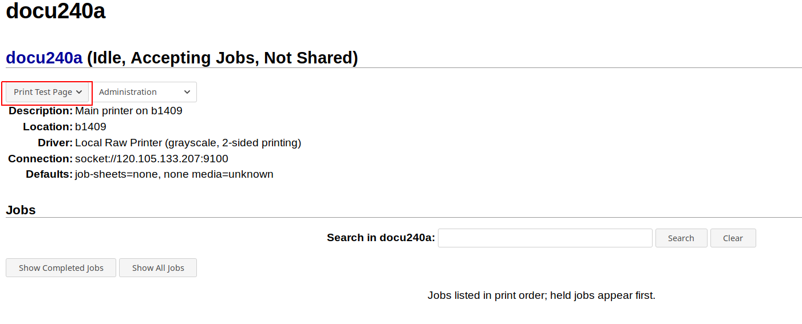

# C05.Configure CUPS\(Printer\)

## 1. Install package

### 1-1. Needed package

```bash
sudo pacman -S cups ghostscript gsfonts samba
#(ghostscript: translater for postscript)
#(samba: Internet printer protocol for windows and windows server)
```

If your manufacturer of printer  is Hp, you can install this package:

```bash
sudo pacman -S hplip
```

This does not require manual installation of the driver \(.ppd file\).

## 2. Start CUPS deamon

```bash
sudo systemctl start cups-browsed.service
sudo systemctl enable cups-browsed.service
```

## 3. Add printer

### 3-1. Open Web browser, type following to URL

```text
localhost:631
```

### 3-2. Press "Adding Printers and classes"


### 3-3. Press "Add Printer"


### 3-3. Type "root" and "password of root"


### 3-4. Select "IPP/IPPS/LPD/LPR Host or Printer", press Continue (Recommend ipp or ipps for fully function of printer)

* If IPPs can't use after you print, replace ipps with ipp


### 3-5. Type IP, press Continue

* socket://<your_printer_ip>:9100 for LPD
* ipps://<your_printer_ip> for ipp
* ipps://<your_printer_ip> for ipps


### 3-6. Type these data


### 3-7. Select driver

#### 3-7-1 LPD

PPD driver can be download on your manufacturer of printer.

Press "Browse"

Select  your "\*.ppd" fle

press "Continue"


#### 3-1-2 ipp/ipps

Recommend driver will show up if you've installed *hplip*


### 3-7. Select A4 size for default


### 3-8. Press Set Default Options


### 3-9. Successfully setting


### 3-10 Print test page


