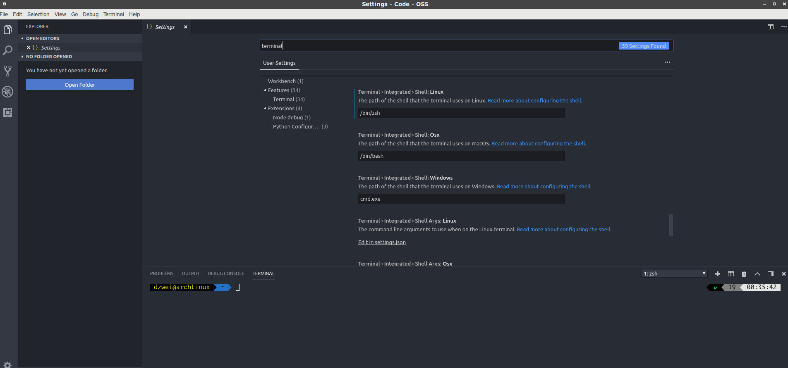

# C06.Configure zsh

## 1. Install necessary package

```bash
sudo pacman -S zsh zsh-completions zsh-autosuggestions #necessary
```

## 2. Install oh-my-zsh

Go here to download those files:

```text
git clone https://github.com/robbyrussell/oh-my-zsh.git oh-my-zsh
```

and install it:

```bash
cd ./oh-my-zsh/tools
sh install.sh
```


## 3. Configure themes for powerlevel9k or bureau

You then need to select this theme in your 

`~/.zshrc`:

```text
ZSH_THEME="bureau"
```


## 7.Configure zsh for vscode-terminal

Go to `settings`

Search `terminalter`

rolling down to `Terminal>Integrated>Shell:Linux`

key in `/bin/zsh`

result like:


