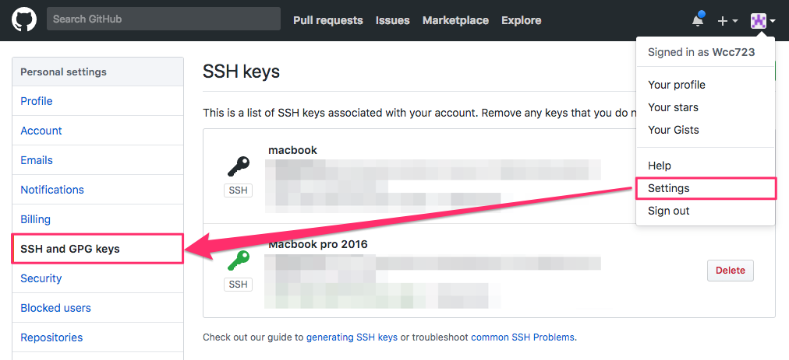
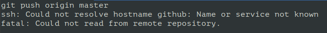

# C07.Configure SSH for github

## 0. Configure /etc/ssh/ssh\_config

go to `/etc/ssh/ssh_config`

```text
sudo vim /etc/ssh/ssh_config
```

append:

```text
Host *
    ServerAliveInterval 60
```

## 1. Generate SSH-Key

```bash
ssh-keygen -t rsa -C "comment"
#-t => type, -C => comment
```

after key in, terminal will show:

```bash
Generating public/private rsa key pair.
Enter file in which to save the key (/home/username/.ssh/id_rsa):

#<type enter>

Created directory '/home/username/.ssh'.


Enter passphrase (empty for no passphrase):

#<type enter after you type your passwd>

#if you don't key in pass word, then you can login ssh without pass work

Enter same passphrase again:

#<type enter after you type your passwd>

Your identification has been saved in /home/username/.ssh/id_rsa.
Your public key has been saved in /home/username/.ssh/id_rsa.pub.
The key fingerprint is:
SHA256: ********************************************* mani_name
The key's randomart image is:
+---[RSA 2048]----+
+----[SHA256]-----+
```

## 2. Set ssh-agent

```bash
ssh-agent -s
eval `ssh-agent -s`
# -s: /bin/sh
```

## 3. Add key to ssh-agent

### 3-1. Check whether there are previous key

```bash
ssh-add -l
```

#### 3-1-1. Key does not exist in the ssh-agent

If key does not exists in the ssh-agent:

Go to `Step 3-2 "Add key"`

If key exists in the ssh-agent:

Go to `Step 3-1-2.`

#### 3-1-2. Key exists in the ssh-agent

If key exists in the ssh-agent, you can remove it from ssh-agent:

```bash
ssh-add -D
```

Next, delete all ssh-keys of the folder

```bash
rm -r ~/.ssh
```

Go back to `Step 1 "Generate SSH-Key"` to reset ssh-keygen

### 3-2. Add key

```bash
ssh-add ~/.ssh/id_rsa
```

Go to `Step 4 "Dump and copy your public-key"`

## 4. Dump and copy your public-key

```bash
cat ~/.ssh/id_rsa.pub
#copy result of above
```

## 5. Put your public-key in your github



## 6. Check setting whether success

type

```bash
ssh -T git@github.com
# Attempts to ssh to GitHub
```

you may see:

```text
The authenticity of host 'github.com (207.97.227.239)' can't be established.
# RSA key fingerprint is 16:27:ac:a5:76:28:2d:36:63:1b:56:4d:eb:df:a6:48.
# Are you sure you want to continue connecting (yes/no)?
```

type “yes”,

if you look following output,

```texe
Hi username! You've successfully authenticated, but GitHub does not
# provide shell access.
```

that success.

## 7. Problem of push

If you look following when you push your repository to github:



First, List your type \(ssh or https\) of your local repository

```bash
git remote -v
```

if looking like:

```bash
https://github.com/username/reponame
```

you must replace `https` local repository with `ssh` :

```bash
git remote set-url origin ssh://git@github.com:username/reponame
#or
#git remote set-url origin ssh://git@github.com/username/reponame
```
