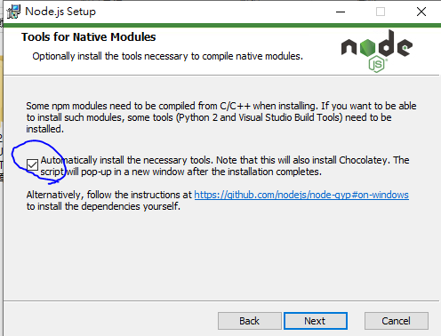

# CM6.Setting nodejs link to c/cpp dll files

## 1. Download VS 2017

### 1-1.Configure environment Path

#### MSBuild

C:\Program Files \(x86\)\Microsoft Visual Studio\2017\BuildTools\MSBuild\15.0\Bin

#### MSVC

C:\Program Files \(x86\)\Microsoft Visual Studio\2017\BuildTools\VC\Tools\MSVC\14.16.27023\bin\Hostx64\x64

#### you can also install VS-2019: v141 package to replace VS-2017

Because the version of VS-2017 is v141 package, this is included in VS-2019

### 1-2. test

`MSBuild`

`cl`

If above command return their version then success.

## 2. Download python2 and python3

Look here to setup:

[How_to_install_Python 2.7_and_3.6_in_Windows_10](https://datascience.com.co/how-to-install-python-2-7-and-3-6-in-windows-10-add-python-path-281e7eae62a)

Set execute name:

`C:\Python27\python.exe` -> `C:\Python37\python27.exe`

`C:\Python37\python.exe` -> `C:\Python37\python3.exe`

_**About environmental variable of priority, python27 must be larger than python3**_

## 2. Download nodejs \(latest\)

Don't forget to check it when install:



After install,

you can see that nodejs installer into shell install.

Just type enter to install.

## 3. Configure environment for nodejs and MSVC

### 3-1. Open terminal \(with authority of system administrator\), type

#### configure version of MSVC is 2017

`npm config set msvs_version 2017`

#### install node-gyp for all users \(global\)

`npm install -g node-gyp windows-build-tools`

## 4. Start project

### 4-1.Create project folder and open terminal here\(without authority of system administrator\)

```text
npm init

npm install electron --save-dev  

npm install electron-rebuild --save-dev
```

### 4-2. Modify package.json

```text
"scripts": {

    "start": "electron .", //solution of launch

    "postinstall": "electron-builder install-app-deps"//auto build

  },
```

### 4-3. Install ffi

If above configure is fine, there are not report errors.

```text
npm install ffi --save
```

### 4-4. Install plugin for ffi

```text
npm install buffer --save

npm install stream --save

npm install iconv-lite --save //漢字解碼
```

## 5. Start to coding
